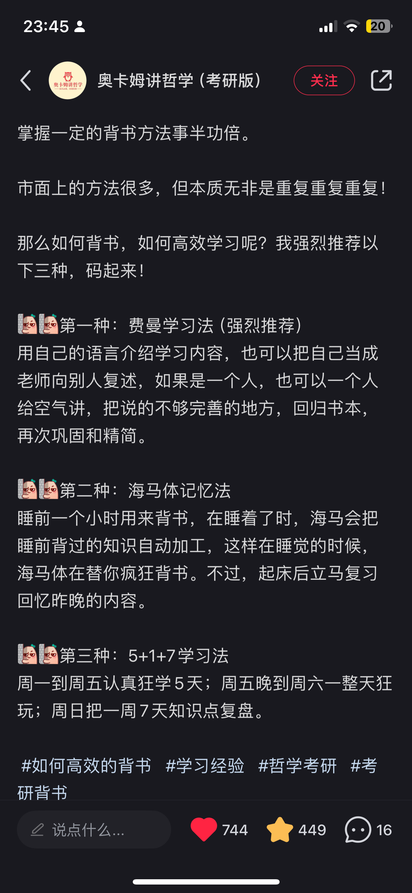

基于【番茄ToDo】APP的时间管理
**加入码【BD29740A】**

自习室名为<b>【每天3小时万事如意】</b> 因为早中晚各抽出1小时忙于喜欢的事情而不被琐事阻拦已经很不容易。不过本自习室也认为<b>【实际的进步＞时间的投入】</b>虽然时间的投入是必须的，但如果完不成3小时也无妨，只求每天有所进步。人生短短，每时每刻的选择塑造了人，荒芜虚度空悲切。

## **一些学习方法**

1. **卢曼** 卡片笔记学习法
2. **柳比歇夫** 时间统计优化法 [奇特的一生](https://book.douban.com/subject/36638526/)（书不好看但理念可以学一下）
3. **费曼学习法**
4. **海马体记忆法**
5. **5+1+7学习法**
↓

## **一些辅助专注的方法**
1. **开启学习内容对他人可见**
（有利于组内相互激励）
2. **具体化专注项目**
（比如写论文时尽量不要归成“学习”这种大类，可以具体为“4000字心理学论文”，后期也可以分析自己在任务上的时间花费。
（不过在app上写具体目标可能比较麻烦，可以写在纸上
（这些目标/要解决的问题最好是在任务开始前就明确好，防止盲目/划水
3. **不要对自己太苛刻**
（如果一天没有学习，也不需要苛责自己，慢慢来。
（另外本自习室只在无人学习的时候清理长期不上线的同学，不必担心短期内被移除。）
## **技术支持**
1 可以用**NFC小卡片**做快捷计时。实现碰碰小卡片自动计时。
2 苹果手机可以通过**快捷指令**，将计时与日历备忘录等应用相连接，更加方便记录和复盘。（`2024.10.26` 现在app的新版本已经支持日历记录了，可以直接从设置里设置一下✓。）

## 其他专注工具推荐
| 名称 | 链接 | 推荐理由 |
| --- | --- | --- |
| **Habitica** | [Habitica - Gamify Your Life](https://habitica.com/) |100%好用|
|Habitica Pomodoro SiteKeeper|[🔗](https://chromewebstore.google.com/detail/habitica-pomodoro-sitekee/iaanigfbldakklgdfcnbjonbehpbpecl)|habitica的计时插件|
| **我的小目标** | [My Goals](https://apps.apple.com/cn/app/%E6%88%91%E7%9A%84%E5%B0%8F%E7%9B%AE%E6%A0%87-my-goals/id1051212505) |可以保存数值|
| **人升** | [人升LifeUp](https://www.lifeupapp.fun/zh/index.html) |
| **Forest** | https://forestapp.cc|  |
| **Focumon** | [https://www.focumon.com](https://www.focumon.com/) | 游戏化专注 |
| **自律石头** | [自律石头-走路读书换时间，不做手机控](https://apps.apple.com/cn/app/%E8%87%AA%E5%BE%8B%E7%9F%B3%E5%A4%B4-%E8%B5%B0%E8%B7%AF%E8%AF%BB%E4%B9%A6%E6%8D%A2%E6%97%B6%E9%97%B4-%E4%B8%8D%E5%81%9A%E6%89%8B%E6%9C%BA%E6%8E%A7/id6479392365) | 控制手机使用时间 |

## 小组常驻大佬

| **大佬** | **大佬签名** | **最后记录的活跃时间** |
| --- | --- | --- |
| 佳音已至 | Break a leg. | 2025-6-23 |
| 鹿儿 | 🍅 | 2025-6-23 |
| rrrainy☔ | 我确信野心勃勃是我最美好的品质 | 2025-6-23 |
| **月末维护** | **感谢陪伴一年的自习室友友们~** | 2025-6-23 |
| riceballᵔᴥᵔ  | with SH | 2025-3-13 |
| 呼噜 | 库库就是干 | 2025-3-13 |
| 你的子期 | “只要思想不滑，坡办法总比困难多” | 2025-3-13 |
| 白衣要更好 | 每天的微小积累决定最终结果 | 2025-3-13 |
| 慎独自律 | 人生之路 | 2025-3-13 |
| 〇〇 | 等枝芽，成繁花 | 2025-2-24 |
| 大jio板👣 |  | 2025-2-24 |
| 当归 | 我的神明啊 请你怜爱我 | 2025-2-24 |
| anarrow | even if | 2025-1-19 |
| （一个管理员复制不了的加油颜文字） | 道阻且长，行则将至。 | 2025-1-7 |
| 若你不曾与他人两心同 | 啊啊啊啊啊不要再拖延了 | 2025-1-7 |
| ZOE | 美好的事情可不可以发生在我身上 | 2024.11.4 |
| 远离躺平，专注自己 | 努力是许愿成功的前提 | 2024.11.5 |
| 阿Xuan | 加油**(ง •̀_•́)ง** | 2024-10-26 |
| 最好朝南 |  | 2024.10.6 |
| 鹿枕河 | 我喜欢苏州的夏天 | 2024-10-28 |
| Girasol | 朝露昙花 咫尺天涯 | 2024-10-26 |
| 醒久会困 | 主动出击 | 2024年8月31日 |
| 佛昂西邑 |  | 2024.9.28 |
| 谦野 | 满意，求己 | 2024年9月8日 |
| 向我推学习 | 摸 | 2024年9月5日 |
| 向上走 | 上岸！！！！ | 2024年9月7日 |
| 朝凪渝风 | 考试顺利通过🙏 | 2024年9月13日 |
| 小喵你可以喵喵 | / | 2024年8月30日 |
| 也未可知 | 流泪撒种的必欢呼收割 | 2024-3-6 |
| 小蓝鲸是紫色的鲸 | 一定要加油啊 | 2024-2-26 |
| Star皆不空💫 | Today is a gift. | 2024-1-27 |
| 记忆面包🍞 | 记忆力无限∞法力无边 | 2024 |
| 陈发发 | 日拱一卒，功不唐捐。 | 2024 |
| 所以你睡了没 |  | 2024 |
| 友人A |  | 2024 |
| 叶与千秋_ | 且向花间留晚照 | 2024 |
| 再努努力叭！ | 低头是题海 抬头是前途！ |  |
| 知识是死的 人是半死不活的 |  |  |
| 拒绝拖延 | 每天都要学习 |  |
| Xmatter | 专注眼前 |  |
| Ryuki | 我爱学习学习爱我 |  |
| 勤奋姜姜 | GO!GO!GO! |  |
| 不要浪费时间了 | 尽全力 珍惜最后的学生时代 |  |
| 早餐一杯豆浆 |  |  |
| Talia | Downed in living waters |  |
| 毕业啦 | 求职中 |  |
| 雩风拾柒 |  |  |

2022年自习室里有20多人，开春清理了不上线的朋友
2023年末已满50人，目前在清理断联的uu账号~
2024年9月由管理员移除（或更改昵称）（默认已经完成学习:D 有需要的友可以再加回来！）：

| 用户昵称 | 用户签名 |
|:---|:---|
| 无籽茄好好学习 | |
| 日暮 | 好学力行，自强不息 |
| 雅思鲨手 | 10月拿下7.5 |
| momo | |
| win- | 不想学一点 |
| Joana | 跑完全程！ |
| 进阶学霸中QAQ | 证明给他们看 |
| supine | 学习学习学习学习学习 |
| 水母碰碰碰 | 天下凡人皆庸于懒 |
| 海迹 | 然我等注定追求辉光，一如火花向上飞舞。 |
| 路过大象公园 | 不破不立 |
| 山乾 | 人类的意志是宇宙在漫长坍缩中最惊人的一瞥 |
| Ferry | |
| w | |
| 白豆腐 | Whatever is worth doing is worth doing well. |
| moomin | |
| 戈祁安 | |
| 暴走小狂鸭 | |
| 望远山 | Focus on yourself！！！！！ |
| Luya𐂂 | 上岸❗❗ |
| 序 | 学习新思想，争做新青年。 |
| 折只大虾（寒假版） | 放假中——休息几天 |
| 一咋往前冲 | |
| 清水涟漪Jing | 锦上添花，或独自风华。 |
| Thing | |
| ****** | |
| 积极不废人 | |
| 无难 | |
| 顾思唐 | 我走路虽慢，但我从不后退。 |
| 今天喝够1500c了吗 | |
| 椰椰 | ٩(๑^o^๑)۶ |
| 此山域外 | 主动且有目的 |
| 🍅wink🍅 | |
| 熊熊要努力 | 今天也要加油呀 |
| 今天写论文了吗（毕业倒计时） | 预答辩顺利通过✅ |
| | |
| serendipityxx7 | 慢慢来，才比较快 |
| 迪迪 | |
| 葫芦葫芦鸭 | |
| 荼蘼花吃奥利奥 | 奥力给 |
| 人在图书馆不计时 | 一以贯之的努力，不得懈怠的人生。 |
| WXAIHXF我们要上岸 | |
| 橘井饴糖 | 期末冲刺科科80加油呀 |
| 读研努力版 | 2023开启努力模式 |
| SWUFE 等着我吧！ | |
| Young11 | We Move |
| 快乐小狗 | 勇敢点，人生就这一次 |
| | |

## 其他

一年之计在于春，一日之计在于晨，友友们做好计划，定好目标，每天付出一些努力，再多做好事、积善积庆，有什么不能实现呢！

以上内容不断更新中～

~~手动相关标签：考公考编考研教师资格证高翻高考；拖延自律摸鱼划水专注打卡时间管理；暑假自习自我提升成长能量冥想~~ 🔚