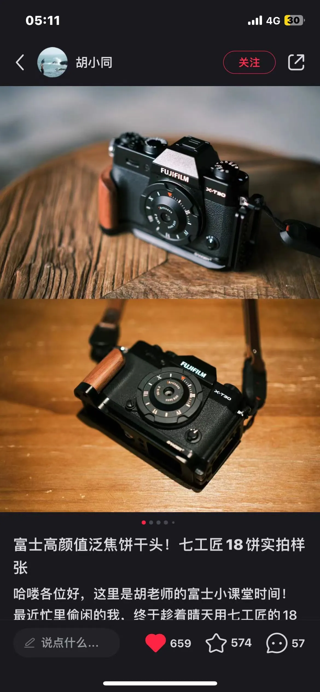
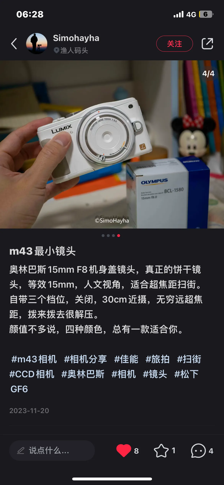

## 2025-12-27
从notion 把这篇搬过来了，搬过来感觉显示不是很好看呜呜。虽然markdown发布很方便但是感觉富文本编辑出来的博文更好看一些（目前我：依靠一些复杂的html语法……

## 2024-01-03

|相机| 闲鱼价格2024年1月5日 | 缺点 | 优点 |
| --- | --- | --- | --- |
| 奥林巴斯ep5（购入） | 1500单机 | 拨轮容易坏 | 除了缺点都很适合我 |
| 奥林巴斯em10.1 |  | 没觉得拍人好看啊() | 画质比epl高  |
| 奥林巴斯em1 |  |  |  |
| 松下gf9 |  |  | 有橙色的很漂亮 |
| 理光gr3x |  | 定焦，对焦慢 | 画质？ |
| 佳能6d | 2000+单机身 | 重 别的没了
需要再买长焦头
还是想要一个便携的 | 相比5d2轻一点高感好一点 收到坏机器概率低一点 |
| 佳能70d（在用） |  | 残幅 | 抓拍很快 |
| 富士x100t（在用） | 3500 | 定焦总觉得不够用啊
感觉出片不够清透，有点刻板，难受 | 随手拍挺方便 |
| 佳能5d2（已出） | 1200（我卖的） | 对焦好糊 好容易过曝 | 全画幅中端机 可玩度高 除了容易糊都还挺不错的 |
| 奥林巴斯epl6（排除） | 2500双镜头（14-42 40-150）+闪光灯 | 老相机 可能单机身800就够？1500全套我收
拍人好像一般般
**感觉画质很拉胯🚬** | 看到奶白色的挺好看 |
| 索尼黑卡6（排除） | 5200+手柄 | **十分担心画质像手机** | 美丽 小巧 长焦 |
| 索尼zve10（排除） |  | **避雷颜色发黄拍不了人** |  |
| 佳能g7x3（排除） |  | 感觉脸拍得很粉 有点平面化 |  |
| 
镜头
 |  | | |
| 中一光学25mm 0.95（购入） |  |  |  |
| 奥利奥饼干玩具头（购入） | 60 | 玩一玩当镜头盖了 |  |
| 七工匠18mm 一代泛焦 |  | 太好看了成像也好但没有m43头😟 |  |
| 奥林巴斯40-150mm |  | 想要这个白菜价长焦 |  |
| 佳能50mm小痰盂（在用） |  |  |  |
| 
配件研究
 |  |  |  |
| Vf3取景器 银色 |  | 小巧 |  |
| Vf4取景器 黑色 |  | 大但是性能最好 |  |
| ↑以上 |  |  |  |

一些美丽机身与镜头照片：

🔚